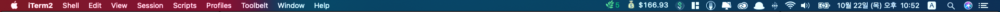

# earning-admob-bitbar 💰
💰 show directly your earning of admobs for month. 




# Usage 
1. move files into your bitbar plugin folder.
2. add  your `client_secrets.json` file from google clound developer api console 
3. change `PUBLISHER_ID` in `admob.3h.py` 
```
PUBLISHER_ID = 'PUB-XXXXXXXXX'
```

4. Done 🎉
